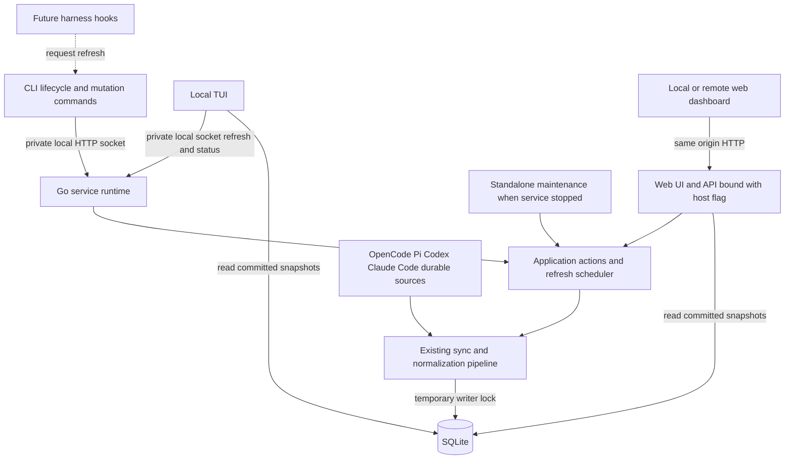

# TokenInsights service architecture proposal

Status: Decisions confirmed; implemented after revalidation. See [the implementation plan](IMPLEMENTATION.md) and [validation evidence](VALIDATION.md). SQLite schema unchanged.

Researched: 3 October 2026. Repository inspected at `19f883fabadc3bad2ccbecb341efa779d1f5dd8f`.

TokenInsights should run one persistent Go service per local database. The service hosts the dashboard and coordinates refresh; opening the dashboard reads saved usage, opening the TUI requests refresh, and web Refresh requests refresh explicitly. Service lifetime and data freshness become separate concerns.

Recommended starting architecture: a private local control socket, the existing HTTP dashboard, the existing sync/normalization pipeline, and read-only SQLite queries in the TUI. Keep one binary and one Go module. No SQLite schema change is needed for service management or the initial refresh scheduler.

The [implementation plan](IMPLEMENTATION.md) specifies code changes, control messages, scheduling, migration, and completion gates. Its detailed startup ordering refines this proposal: the child commits validated configuration/discovery before announcing readiness, while the parent holds lifecycle admission.

## Confirmed product decisions

- First start initializes an empty dashboard. Service start/restart never triggers ingestion; TUI opening or explicit Refresh does.
- Remote web UI/API access uses a trusted network. Authentication is deferred and out of scope for this feature.
- Login/reboot autostart and OS service installation are deferred.
- `--host` controls only the web UI/API server bind. The TUI always runs on the local machine, reads its local database, and requests refresh through the private local socket.

## What good looks like

- Repeated `tokeninsights` invocations quickly print the same running service and URL. They neither ingest data nor restart it.
- Closing the launching terminal or TUI leaves the service and accepted refresh running.
- A browser bookmark opens saved usage without source discovery or parsing. Its Refresh button schedules ingest plus normalization.
- `tokeninsights view` shows compatible saved usage immediately and requests an all-harness refresh. Filters constrain display, never ingestion.
- Two concurrent starts produce one service. Multiple viewers produce bounded refresh work, not competing writers or an unbounded queue.
- Ordinary refresh failure preserves committed usage and the prior successful check time. Recovery-required data remains unavailable until recovery succeeds.
- `status` distinguishes service availability, current refresh, last successful refresh, and data compatibility.
- Stop/restart works for loopback, a specific interface, wildcard binding, and dynamically assigned ports without making callers remember those settings.
- Existing custom-source, dry-run, full-refresh, normalization, and reset workflows remain usable. Their source configuration is explicit.
- Future harness hooks request work through the same application boundary. Durable artifacts remain authoritative; hooks need not transmit tokens or transcripts.
- Idle resource use is bounded; release binaries need no Node, npm, pnpm, shell scripts, external process-discovery tools, or separately installed daemon.

These are acceptance criteria, not measured performance claims. Benchmark warm command latency, dashboard queries, unchanged refresh, memory, and idle activity before choosing numeric performance budgets.

## Research findings

### Agent browser

Agent-browser separates a native CLI from an automatically started daemon that persists across commands. Its current documentation specifies a default one-hour idle shutdown, configurable or disabled. That timeout protects browser resources; a bookmarked analytics dashboard has different lifetime requirements. Recommendation: borrow automatic startup and reuse, but keep TokenInsights running until explicitly stopped or the user session ends. [Architecture](https://agent-browser.dev/#architecture).

The inspected implementation reexecutes the installed executable, detaches it on Unix, checks socket readiness, and handles competing starts and configuration/version differences. Unix uses a local socket; Windows has a TCP fallback. These demonstrate that process discovery, startup readiness, and version negotiation are substantive parts of the design. TokenInsights should implement those contracts explicitly rather than only backgrounding the existing server. [Pinned client implementation](https://github.com/vercel-labs/agent-browser/blob/39a74c70d7759d5a6de7a22c04570bb626bbd081/cli/src/connection.rs), [pinned daemon implementation](https://github.com/vercel-labs/agent-browser/blob/39a74c70d7759d5a6de7a22c04570bb626bbd081/cli/src/native/daemon.rs).

### Existing TokenInsights foundations

The current code already provides most data correctness machinery:

| Existing component | Architectural implication |
| --- | --- |
| `internal/cli/command.go` | Bare invocation and leading flags currently dispatch to TUI. This is an intentional CLI behavior change. |
| `internal/server/server.go` | Foreground lifetime, startup sync, browser launch, and process-local scheduling are coupled. Extract scheduling and lifecycle policy. |
| `internal/cli/table.go` | TUI runs its own pipeline and cancels its context on exit. Replace refresh ownership; preserve rendering and read snapshots. |
| `internal/db/writer_lock.go` | Database-scoped interprocess writer serialization already exists. Preserve it for service and standalone commands. |
| `internal/db/sync_status.go` | Durable jobs, progress, publication revision, and interrupted-job detection already exist. Avoid a second durable job model. |
| `internal/pipeline/sync_job.go` | Jobs persist scope fingerprints; successful all-harness normalized checks have distinct completion bookkeeping. |
| `internal/pipeline/sync.go` | Recovery, source verification, bounded parsing workers, single-writer persistence, and normalization remain reusable. |
| `internal/server/data.go` | Dashboard rows are aggregated, sorted, then paginated in Go. Pagination currently does not bound query/aggregation work. |
| `packages/web/src/api.ts` | Existing status polling observes running jobs and canonical revisions. Reuse this before introducing event streaming. |
| `docs/openapi.yaml` | Public HTTP transport is already generated and validated across Go and TypeScript. Keep it authoritative. |

Two current behaviors need particular attention. Server joining tests all-harness/normalization flags but does not compare the source fingerprint exposed by the job machinery. A custom-root job must not satisfy a request to refresh the service's default sources. Also, process-local fallback revisions and durable revisions are mixed during startup. The service should treat durable publication state as authoritative when available.

Release targets currently cover macOS and Linux. The database writer lock already uses Unix APIs. Windows portability should be a separate project, not an implicit requirement introduced by this service.

The current design document supersedes the older 48-hour source-skipping proposal: unchanged-source reuse now requires content/continuity verification. A persistent daemon does not make that work disappear. [Current design](../../docs/design.md), [historical refresh ADR](../../docs/adr/0004-incremental-source-refresh-and-local-continuity-state.md).

## Architecture choices

| Approach | Benefit | Cost | Assessment |
| --- | --- | --- | --- |
| Background the existing server | Smallest initial patch | Startup sync, browser launching, job ownership, stop/discovery, and configuration remain entangled | Useful prototype; insufficient final design |
| Service owns mutations; TUI reads SQLite | Reuses current local queries and offline viewer; centralizes refresh and service control | Two read transports remain | Recommended |
| Every client uses daemon APIs for reads and writes | One query transport and centralized caching | Larger TUI rewrite; serialization/pagination; offline viewing needs another path | No current requirement justifies this rewrite; TUI remains local |

The recommended design makes the daemon the normal mutation coordinator while it runs. When it is stopped, explicit maintenance CLI commands retain their standalone execution path. It does not claim that SQLite has only one possible process; the existing writer lock remains the correctness boundary.



A local control connection uses HTTP over a Unix domain socket. This reuses Go's HTTP client, routing, deadlines, JSON handling, and tests without inventing a line protocol. The public TCP listener remains dedicated to the dashboard/API. Lifecycle and reset handlers are never registered on that listener.

## Command contract

| Command | Proposed behavior |
| --- | --- |
| `tokeninsights` | Ensure configured service exists; print status; exit. No ingest or automatic browser launch. |
| `tokeninsights service start` | Idempotently start/reuse service. Wait for readiness, not refresh completion. |
| `tokeninsights service stop` | Stop the selected instance; already stopped succeeds. |
| `tokeninsights service restart` | Stop then start under one lifecycle operation lock; preserve settings unless overridden. |
| `tokeninsights service status` | Read-only probe; print actual URL, bind, version, process identity, and freshness. Never start or repair. |
| `tokeninsights service run` | Foreground runtime for development and future OS supervision. Same instance ownership rules. |
| `tokeninsights view` | Ensure service; request all-harness normalized refresh; open TUI on saved data. |
| `tokeninsights view --no-sync` | Existing read-only semantics. No service startup, DB creation, recovery, or ingest. |
| `tokeninsights refresh` | Recommended convenience command: ensure service and request asynchronous refresh. |
| `tokeninsights refresh --wait` | Wait for the refresh satisfying this request; return its outcome. Useful later for hooks/tests. |
| Existing `sync`, `normalize`, reset commands | Preserve options, output, confirmations, and exit behavior; use service when active, standalone when absent. |

`refresh` is a recommendation beyond the four requested service actions. It gives future integrations a small stable command without making them depend on HTTP endpoints or database structure.

`--open` can explicitly open the dashboard for bare invocation or `service start`, whether newly started or already running. Browser opening belongs to the initiating CLI process. The daemon never launches a browser itself.

Bare `tokeninsights --today`, `--model`, and similar old viewer invocations should fail with a concise migration hint to `tokeninsights view ...`. Do not silently interpret a viewer filter as service configuration. Root `--help` and `--version` stay side-effect free.

### Host and port

```sh
tokeninsights service start --host 127.0.0.1 --port 8765
tokeninsights service restart --host 0.0.0.0 --port 8765
tokeninsights --host 127.0.0.1 --port 9000
tokeninsights service status
tokeninsights service stop
tokeninsights view --today
```

`--host` controls only the web UI/API listener. It is accepted by `start`, `restart`, `run`, and the bare start alias. `view` does not accept it: TUI operation is always local and independent of the TCP bind. `status`, `stop`, and TUI refresh discover the private local socket from the local database identity. Preserve the existing explicit-IPv4 contract initially; DNS bind names and IPv6 are independent extensions.

With `--host 0.0.0.0`, a remote browser opens `http://<service-machine-IP>:<port>`. Its API requests and Refresh action target that same service machine and its durable sources. Local TUI reads and refresh routing remain unchanged.

Default bind remains `127.0.0.1:8765`. Explicit `--port 0` selects an available port and status reports the assigned port. Default-port conflict fails with a useful error and suggests `--port`; never prompt to terminate another listener or silently move to another port. A stable bookmark is part of the product requirement.

While running, `start` with no explicit binding change prints status. An explicitly conflicting host/port returns an error containing the current bind and the corresponding `restart` command. Treat saved `port: 0` as the configuration; its actual assigned port is runtime state.

Wildcard binding is not a usable dashboard destination. Example status:

```text
running · version <version> · pid <pid>
dashboard  http://127.0.0.1:8765
listen     0.0.0.0:8765
refresh    idle · last success <time or never>
```

List reachable interface URLs as optional candidates, not guaranteed external addresses. Never claim `http://0.0.0.0:8765` is the URL to bookmark. Preserve the distinction between serving machine identity and the existing saved ingest hostname shown in the dashboard.

`status --json` should expose explicit lifecycle and freshness fields rather than requiring callers to parse text. Proposed exit codes: 0 for responsive service, 3 for stopped, 1 for unreachable/invalid state, 2 for usage. Last-refresh failure is a status field, not proof the service is stopped.

## Service identity and configuration

Use one service per canonical database path, scoped to the current user. Reuse a single canonicalization implementation for service identity and the existing writer lock, including relative paths and symlinked parent directories. Hash that identity for short runtime names; verify the complete identity in the handshake. This stable database key differs from the random runtime instance ID used by clients. Hard-link aliases are unsupported in V1; reject an existing database with multiple hard links before managed ownership.

This allows a production database and a development fixture database to coexist. Each has separate ownership, configuration, and control socket. TCP port conflicts remain explicit; a second instance must choose another port or `0`.

Store configuration outside SQLite:

- Configuration: `${XDG_CONFIG_HOME:-~/.config}/tokeninsights/instances/<id>.json`.
- Logs: `${XDG_STATE_HOME:-~/.local/state}/tokeninsights/instances/<id>/`.
- Socket/discovery: `$XDG_RUNTIME_DIR/tokeninsights/<id>/` when valid; otherwise a private runtime directory under the state directory.
- Stable lifecycle locks: beside the canonical DB, independent of runtime-directory cleanup.

XDG distinguishes configuration, persistent state, and runtime files; runtime directories have ownership/lifetime requirements. Use those categories instead of mixing logs and settings into the analytics database. [XDG specification](https://specifications.freedesktop.org/basedir/latest/).

Create private service directories with mode 0700, and configuration/discovery/log files with 0600. Validate ownership and reject symlink substitution. Validate socket-path length before spawning. Do not rely on an unprotected shared `/tmp` name.

Configuration contains a file-format version, canonical DB identity/path, requested bind/port, and resolved source roots. Explicit bind flags override saved binding; otherwise saved values override optional environment defaults, then built-in defaults. DB selection remains `--db-path`, then `TOKENINSIGHTS_DB_PATH`, then the existing default.

Resolve source roots at first setup and persist only the relevant roots. Later refresh uses this explicit configuration, not the caller's current shell environment. Proposed `service restart --reload-sources` deliberately resolves source roots again from the supported harness environment settings. Ordinary start/restart preserves saved roots. While recovery is pending, scope mismatch still rejects before writes.

Do not persist the entire inherited environment: it can contain credentials and unrelated state. Private configuration can contain necessary local paths; it is operational configuration, never raw facts, canonical analytics, or future export. Changing source paths must not silently change analytics identity rules.

Write saved configuration only after successful startup. Restart validates the proposed configuration before stopping where possible; if binding the new address fails, preserve the prior saved settings and report stopped/start failure. Do not claim restart is atomic or silently fall back to a different bind.

## Process lifecycle

Use two distinct service locks in addition to the existing writer lock:

1. A short-lived lifecycle operation lock serializes CLI start/stop/restart transactions.
2. A service ownership lock is held by the daemon for its entire lifetime. It is never the database writer lock.

Holding the database writer lock for daemon lifetime would block maintenance and make sync-status lock observation falsely imply an active job. Persistent lock sidecars must not be unlinked while live; kernel ownership, not file presence, proves a lock is held.

Startup sequence:

1. Resolve identity and validate proposed configuration; acquire lifecycle operation lock.
2. Probe the existing socket with a deadline and validate protocol, database identity, and service instance nonce.
3. Reuse a matching responsive instance. An owned but unresponsive instance is an error, not permission to spawn another.
4. If ownership is free, remove stale runtime artifacts under the lifecycle lock and spawn the same executable by absolute `os.Executable()` path.
5. Child detaches using platform-specific Unix support, acquires lifetime ownership, and creates/validates the DB as described below.
6. Bind both listeners, start handlers, and publish discovery atomically with actual port and instance identity.
7. Child commits configuration/discovery after successful initialization and sends readiness or a structured startup failure through a dedicated parent-child channel. Parent confirms identity, prints status, and exits.

Do not use the shell, `nohup`, `lsof`, `pkill`, PATH lookup, or a PID file as the implementation. Use native process APIs. Go provides subprocess/file-descriptor management; detachment and readiness are still application responsibilities. [Go process APIs](https://pkg.go.dev/os/exec).

Detach stdin from the terminal and direct stdout/stderr to bounded private logs. A readiness pipe must close after startup. Do not leave daemon output connected to pipes that the CLI stops reading. Ensure child reaping does not block CLI return or leave zombies when the parent is a long-running TUI. Do not bind daemon lifetime to the launching command's cancellation context.

Startup cancellation may terminate only the child created by that invocation, with verified identity. It must never stop a service another caller already started. Use a named startup deadline; ingestion never extends it.

Stopping uses the authenticated-by-filesystem local control connection. Reject new work, cancel active work with its own context, finish transaction/cancellation bookkeeping, drain HTTP within a named deadline, close both listeners, remove only this instance's discovery/socket, then release ownership. Verify shutdown before reporting success or starting a replacement.

A bare PID is diagnostic information, not authority to kill. Initial V1 should report an unresponsive owned service rather than implement a unsafe PID-only force stop. A later force option needs platform-specific process-identity validation.

Detached mode survives terminal closure, not necessarily logout, reboot, or a crash. Do not describe it as OS-supervised. Default idle timeout is disabled. Later systemd user services or launchd agents should invoke the same foreground runtime and own restart policy. Do not stack an independent child respawner beneath a supervisor. [systemd service contract](https://github.com/systemd/systemd/blob/main/man/systemd.service.xml), [launchd agents](https://developer.apple.com/library/archive/documentation/MacOSX/Conceptual/BPSystemStartup/Chapters/CreatingLaunchdJobs.html).

## Startup and data readiness

Confirmed policy: service start never ingests or normalizes, including first start and restart. A fresh database is initialized empty under the writer lock; the dashboard explains that Refresh imports retained local usage. The TUI's first opening naturally requests that refresh.

For an existing database, startup inspects compatibility without recovering it. Compatible saved usage is immediately available. Recognized older or rebuild-pending data can leave the control/dashboard server responsive with `recovery_required` or `rebuild_pending`; Refresh invokes the existing recovery pipeline. Corrupt, unrecognized, or newer databases are rejected without replacement.

This prevents installing or restarting a service from silently performing a potentially expensive reconstruction. Existing recovery may lose historical usage whose durable sources were deleted; changing the service architecture must not obscure that existing limitation.

Readiness means listeners and control handlers are usable. It does not mean ingestion succeeded or data is fresh. Health status should separately report service phase, data compatibility, active refresh, last attempt, and last successful normalized all-harness check.

Before compatible operational tables exist, return transport-local startup/recovery state. Once available, durable jobs and revisions are authoritative. Do not generate a successful check timestamp from service uptime or the latest source ingest.

There is no one-time initial background refresh. Empty first-start data is intentional until a viewer requests refresh.

## Refresh scheduling

### Ownership and scope

Put scheduling in a protocol-independent application component. Public web POST, private control requests, TUI requests, and future integrations call it. Accepted work uses the service's lifetime/operation context, never the HTTP request or TUI context. Client disconnect stops observation, not shared refresh.

Ordinary refresh means all configured supported harnesses, using saved source configuration, with normalization. Viewer filters are irrelevant. Preserve pending normalization even when no source facts change.

Equivalence requires the same database, resolved source configuration, requested harness coverage, normalization policy, and refresh strength. An in-progress custom-source sync, `--no-normalize` sync, or ordinary incremental sync cannot automatically satisfy a different root, normalized refresh, or explicit `--full-refresh` request. Reuse durable `scope_key` machinery for source comparison and typed in-memory requests for refresh strength. When an external job's required properties cannot be proven, wait and run the requested work rather than falsely joining it. No new table is required; do not duplicate fingerprint rules in transports.

### Requests arriving during refresh

Purely joining every active run can miss new usage. Example: Codex has been checked, then a Codex session finishes while Pi is being checked. A hook or newly opened TUI requests refresh. The active run will not revisit Codex.

Use one active refresh and at most one pending ordinary refresh scope. Requests accepted before source discovery starts can share that upcoming run. Requests accepted after it starts conservatively mark one follow-up refresh pending. Merge repeated pending requests; run the follow-up after the active work completes. A new request during that follow-up can mark the next run pending again.

This bounds outstanding work, not the number of runs under continuous demand. It deliberately trades some extra verified reads for no lost late refresh request. A later optimization can track which requested harness snapshots have already been captured, but only after tests prove the coverage rule.

Keep a small bounded request-generation/ticket model in memory. `--wait` waits for the run assigned to its request, including a queued follow-up, rather than merely any active job. Pending ordinary requests use merged scope; unrelated maintenance work uses a bounded queue with explicit backpressure. Do not silently drop incompatible requests or indefinitely starve manual work behind hooks.

Pending scheduling is best-effort across crashes in V1. Running sync jobs already persist; pending requests do not. A crashed daemon invalidates its request tickets; observers report interrupted/unknown and offer retry. Do not promise exactly-once delivery or automatic replay. Durable pending-event delivery would require a separately approved operational schema and is unnecessary for retained-source correctness today.

### Existing maintenance commands

When the service is responsive and compatible, mutating `sync`, `normalize`, and confirmed resets submit typed local-only application actions and preserve CLI summary/exit semantics. Offline, they invoke the same actions directly without autostarting the service. Dry-run stays a read/preview operation and must retain its no-write contract.

For an exclusive CLI maintenance action, Ctrl+C requests cancellation of that action through private control. A CLI waiting on shared refresh only cancels its observation. Ordinary client disconnection does not imply permission to cancel work another viewer shares. Document and test these distinct ownership rules.

Custom source overrides are per-job inputs over the private socket; they do not reconfigure normal dashboard refresh. Reuse the caller's resolved roots rather than silently substituting daemon environment. Existing recovery scope validation remains mandatory.

If a service owns the database but is unresponsive or incompatible, fail mutating commands with a service diagnostic rather than bypassing it. The writer lock remains necessary for old binaries, external contenders, crash recovery, and standalone use. Never hold that lock while waiting for an action whose pipeline will acquire it again.

Reset actions use a maintenance barrier: serialize mutations, invalidate queued work based on the prior database state, apply the existing transactional reset, and force viewers to discard prior snapshots. Reset cannot silently be undone by a queued pre-reset refresh.

### Publication and observation

Retain existing source/harness transaction boundaries and canonical publication revisions. Query all response parts from one validated read snapshot. Ordinary sync can publish incrementally; incomplete compatibility recovery stays hidden.

Keep revision polling initially. Active polling cadence can follow the existing roughly one-second web cadence; idle checks remain much slower and pause in hidden pages. Polls never trigger ingestion. Remove redundant analytics polling if committed revision changes already cover the required updates.

A durable revision is not globally monotonic across `reset-all`. Add a transport-level data epoch to cache identity, regenerated on service-owned reset, and a fresh service instance ID after restart. Reconnect/reset clears client caches even if a revision number repeats. These values are ephemeral operational state, not canonical schema. Outdated clients writing directly around the service remain unsupported; detect compatibility/reset changes conservatively and avoid long-lived result caches initially.

Future SSE can publish revision/progress hints. Reconnect must fetch durable status, and dropped notifications must never lose data. WebSockets or a general event bus are unnecessary for this feature.

## TUI and web behavior

The TUI always operates on the local machine. It keeps its aggregation, rendering, filters, direct read-only local database transactions, and coverage rules. Replace its direct `pipeline.Sync` call with a request and status observer over the private local socket. The web UI/API bind has no effect on TUI transport or data selection. Decouple the read context from shared refresh lifetime.

Saved compatible data appears immediately with a nonblocking refresh indicator. Date/filter/navigation controls remain available during ordinary refresh. Keep `u` for requested refresh/retry and `r` for rereading committed data. First import shows progress/empty state; recovery blocks analytics until compatible.

Quitting the TUI never cancels service-owned refresh. If the service disappears, retain readable committed data, report interrupted refresh, and offer explicit retry. Routine polling must not restart a service the user deliberately stopped; only an explicit refresh action or a new default TUI opening ensures service startup.

`view --no-sync` remains usable with no running service and does not create runtime directories or lock files. It continues observing existing durable status read-only.

The web mounts by querying instance/status/usage. It never posts refresh because a page opened, reconnected, changed filters, or regained focus. Refresh explicitly schedules ingest and normalization; Reload data only invalidates query reads. Display active/pending refresh, prior successful check, failure, and recovery eligibility consistently with the TUI.

Use UI label Refresh while retaining `/api/v1/sync` as the stable public route. The persisted jobs and pipeline can retain sync terminology. Per-viewer defaults and selections belong to TUI arguments, browser route state, or explicit open URLs; they must not mutate service-wide settings.

Do not change canonical token semantics, provider/model fallbacks, location attribution, coverage meaning, or metric availability as part of this migration. The repository guide and current design document disagree about active TPS presentation; flag that separately rather than deciding it through daemon work.

## API and security boundaries

Retain the five existing public analytics/sync routes. Extend their generated contracts only where clients need pending-refresh state and cache epoch/instance identity. Update `docs/openapi.yaml`, generated Go/TypeScript output, contract tests, and mocks together. No change to SQLite columns is required for these transport fields.

Private control routes cover identity/readiness, status, refresh request/ticket observation, shutdown, and typed maintenance actions. Use an explicit control protocol version, bounded request bodies, validated action enums, safe errors, and deadlines. The service's DB is fixed; handlers cannot select arbitrary databases from requests. Configuration and full operational paths stay off the public API.

Default loopback preserves the existing local access model. A user with access to the private socket already has filesystem authority over that user's data; restrictive directory/socket permissions provide the local control boundary. Administrative routes are not exposed through the dashboard listener, even on loopback.

Confirmed deployment scope is a trusted network with the existing unauthenticated web UI/API access model. `--host 0.0.0.0` enables remote browser/API access to the service machine's usage and Refresh action. Authentication, TLS provisioning, and untrusted-network deployment are outside this feature. They must not become implementation blockers or additional setup requirements.

Add cross-origin mutation protection and validate Host against configured local/network names to address hostile browser requests and DNS rebinding. No CORS headers alone do not prevent every state-changing browser request. Go 1.26 includes `http.CrossOriginProtection`; Host validation is a separate check. Vite proxy origins need explicit development handling. [Go HTTP protection](https://pkg.go.dev/net/http@go1.26.0#CrossOriginProtection).

Future authentication can wrap the web UI/API transport without changing local TUI or lifecycle control. The private local socket remains separate from network binding and browser access.

## Code organization

Keep the existing Go module and public executable. Introduce only the boundaries that have concrete consumers:

```text
internal/cli/
  command_service.go        parse lifecycle commands and print outcomes
  command_refresh.go        request refresh and optionally wait
  command_view.go          ensure service and assemble TUI
  table.go                 observe refresh and render read snapshots

internal/service/
  manager.go               ensure, start, stop, restart, probe
  runtime.go               compose application and listeners
  config.go                explicit settings and source roots
  identity.go              shared database identity and runtime paths
  process_unix.go          detach and readiness handshake
  control.go               private control handlers and typed client

internal/app/
  actions.go               reusable sync, normalize, reset actions
  refresh.go               bounded scheduling and request completion
  status.go                durable state plus pre-DB/recovery fallback

internal/server/
  server.go                public HTTP transport and embedded assets
  data.go                  existing analytics mapping and queries
  api/                     generated public transport types

internal/pipeline/         retain source parsing and normalization
internal/db/               retain persistence and writer lock
internal/viewer/           retain calendar and filter semantics
```

Dependency direction remains transports/commands → application → pipeline/database. `service` composes the runtime; public server handlers receive narrow application methods. `app` must not import the server, service manager, Bubble Tea, or generated HTTP models. Use concrete types and small consumer-owned interfaces, not a generic plugin framework.

Extract scheduling from `server.app.startSync` first. Separate server listener creation from startup-sync and browser policy. Share database identity resolution instead of copying `canonicalDBPath`. Avoid moving every TUI helper or SQL query during this feature; a protocol-independent analytics facade can follow when a second query transport needs it.

## Scaling and future feature pressure

SQLite remains appropriate for one user's local history and a few viewers. WAL supports concurrent readers with one writer; readers must keep transactions short because long snapshots can delay checkpoint progress. Keep the database on a local filesystem, not a network share. [SQLite WAL](https://www.sqlite.org/wal.html), [snapshot isolation](https://www.sqlite.org/isolation.html).

The important scaling limits are elsewhere:

| Pressure | Initial control | Later response when measured |
| --- | --- | --- |
| Repeated historical source verification | Coalesce requests; retain existing continuity proofs | Adapter-specific safe incremental reads; profile bytes read |
| Expensive grouped analytics | Deadlines and bounded concurrent query work | SQL sorting/pagination; query plans; approved indexes/projections |
| Many open tabs | Idle/hidden-page polling discipline; revision invalidation | SSE and bounded shared query cache |
| Frequent harness hooks | One pending refresh, per-harness merge, bounded background demand | Debounce, minimum intervals, backoff; recent-source scheduling with proven semantics |
| Long-lived process state | Bounded queues/logs; release per-job parse caches and source handles | Measured memory budgets and lifecycle diagnostics |
| Operational history growth | Measure ingest/job/source history size and lookup cost | Separate approved operational-history retention policy |

Do not retain harness DB transactions, file snapshots, or parser caches indefinitely in the daemon. They can hide source updates and grow with historical data. Scope parsing/ancestry caches to a refresh job unless a separately verified invalidation rule exists.

Unchanged verification remains proportional to source bytes in important adapters. Service persistence solves repeated server startup and automatic unwanted ingestion; it does not by itself solve refresh I/O. Future performance work must preserve rewrite, ancestry, incomplete-tail, location, and provenance checks.

Future hooks should initially invoke a small refresh command with optional harness/reason metadata. Treat events as hints that durable data may have changed. Debounce noisy idle/session events and use bounded retry for delayed artifact flushes; no endless retry loop. The hook must not send raw token rows, transcripts, paths, or credentials through public endpoints.

Event recording and at-least-once delivery, cloud export, new metric domains, file watchers, and preaggregated facts are separate feature decisions. Remote TUI is outside the product model specified here; the TUI remains local. This architecture leaves application boundaries for future features without requiring them now.

## Failure and upgrade behavior

| Situation | Required outcome |
| --- | --- |
| Concurrent starts | One owner; matching callers reuse it; conflicting explicit configuration reports an error |
| Busy HTTP port | Fail; retain prior saved configuration; never terminate unrelated listener |
| Stale discovery/socket | Clean only after verifying ownership is free |
| Owned service stops responding | Report unresponsive; no duplicate spawn or PID-only kill |
| Terminal/TUI closes | Daemon and accepted shared refresh continue |
| Explicit stop during refresh | Cancel gracefully; preserve commits; terminal status becomes cancelled or later interrupted |
| Ordinary source failure | Continue valid source work per existing pipeline; retain usage and honest partial coverage |
| Pending custom-root recovery | Reject different roots; require original recovery configuration |
| Disk full or unreadable DB | Safe diagnostic; no deletion; no false successful freshness |
| Sleep/resume or transient disconnect | Reprobe and reload status; no implicit ingestion |
| Refresh accepted, daemon crashes | Running job remains diagnosable; pending tickets become unknown and retryable |
| Reset while clients open | Serialize; clear incompatible pending work; invalidate snapshots/cache epoch |
| Installed CLI differs from daemon | Show both versions; negotiate protocol/schema/data compatibility; no hidden restart |

Keep release version, control protocol version, SQLite schema version, and data generation distinct. Exact release equality is not required if the supported protocol/data contract matches. Incompatible clients must refuse mutations and explain `service restart` with the current binary. Older binaries must not restart/downgrade a newer service automatically.

Restart explicitly adopts the current installed executable. It does not trigger data recovery until refresh. Browser clients should detect a changed service instance/build and offer reload when needed; HTML should revalidate, hashed assets can remain immutable, and missing old asset chunks retain the existing reload recovery path.

Use bounded rotating logs with named constants and tests for rotation. Log service lifecycle, version/config fingerprints, job identity, duration, phase, and safe error codes. Never record source contents or secrets. Public errors remain scrubbed; a `service logs` convenience command can be added later without changing runtime ownership.

## Implementation sequence

1. **Extract application ownership.** Move refresh/status logic out of HTTP handlers; introduce explicit source config and shared DB identity resolution. Preserve current CLI behavior while tests establish parity.
2. **Implement managed lifecycle.** Add configuration, private socket, ownership/lifecycle locks, detached startup handshake, stop/restart/status, and foreground runtime. Eliminate interactive port takeover from managed startup. Start remains independent of ingestion.
3. **Implement refresh scheduling and mutation routing.** Add bounded active/pending refresh, request completion, scope matching, maintenance barrier, online forwarding/offline actions, and cache epoch. Update public contracts where required.
4. **Switch user behavior together.** Bare command ensures service; TUI submits refresh and retains read-only queries; web refresh stays explicit; browser launching becomes opt-in. Update help, README, `CONTEXT.md`, `docs/design.md`, API contracts, mocks, and development scripts together.
5. **Validate and release migration.** Exercise real subprocess behavior and native runtime, then publish the changed command contract. Keep `serve` temporarily as a deprecated foreground alias to `service run`; document that startup ingestion is removed and old viewer flags move to viewer/open URLs. Do not preserve an independently owned legacy server.

Each phase should be independently reviewable, but do not ship the new bare-command behavior before lifecycle, ownership, and refresh semantics work together. No service-management schema migration is proposed. Any subsequently justified column/table/index or cross-language storage change needs separate explicit approval.

## Verification plan

Use synthetic durable sources and isolated DB/runtime/config directories. Never use the production database to test resets, crashes, or binding changes.

- Real subprocess tests: terminal detachment, fast parent return, readiness failure, concurrent starts, one-owner invariant, configuration conflict, graceful stop, restart, stale files, and unresponsive ownership.
- Socket/binding tests: explicit interface, wildcard, dynamic port, default-port conflict, private-only admin routes, permission checks, and path aliases. Remote web/API requests reach the service machine; every TCP bind leaves TUI reads and refresh on the local DB/socket. `view --host` is rejected.
- Scheduling tests: request before discovery joins; request after a source snapshot causes follow-up; many requests stay bounded; unrelated/full-refresh/no-normalize scopes do not falsely satisfy each other.
- Lifetime tests: closing TUI or HTTP connection leaves accepted work running; deliberate stop cancels shared work; idle polling does not restart stopped service or ingest data.
- Data tests: unchanged queries preserve totals; refresh publishes committed facts; failures preserve successful check time; recovery scope mismatch refuses writes; reset clears pending work and invalidates matching revision caches.
- CLI compatibility tests: custom sources, dry-run, full-refresh, normalization, confirmation requirements, summaries, status exit codes, root help/version, and migration errors.
- UI tests: browser opening never POSTs sync; button does; TUI opening requests exactly one refresh demand; filters never select ingestion; saved data remains usable during ordinary refresh.
- Upgrade tests: compatible version skew works; incompatible writes refuse; newer service is never implicitly downgraded; stale browser clients recover after restart.
- Load checks: unchanged-source bytes read, large sessions queries, concurrent tabs, long-running memory, bounded logs/history, and cancellation responsiveness. Results inform tuning rather than introducing arbitrary thresholds.

Implementation verification follows repository requirements: `pnpm run format`, `pnpm run lint`, focused tests, `pnpm run test`, applicable schema/API checks, and `pnpm run build`. Build directly from `packages/cli` and run with Node/npm/pnpm absent from PATH. Verify the built project-local binary in a PTY with isolated fixtures for the changed TUI/service flows.

This proposal was verified against source and primary documentation; no TokenInsights binary was launched, performance benchmark run, or production data modified.

## Unresolved questions

None for the product decisions raised in this proposal.
