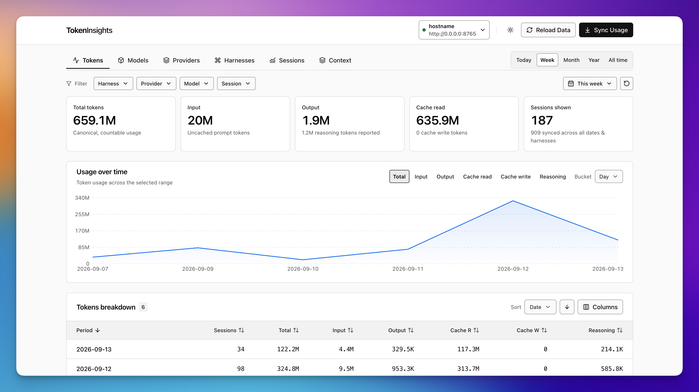

# TokenInsights

TokenInsights is a local token usage dashboard for OpenCode, Pi, Codex, and Claude Code. It parses local session files, stores usage metadata in SQLite, and presents it in a terminal or browser dashboard. Both dashboards refresh supported local sources on startup.

| Web                                                                                  | TUI                                                                       |
| ------------------------------------------------------------------------------------ | ------------------------------------------------------------------------- |
|  |  |

## Install

### Homebrew

```sh
brew install flexdinesh/tap/tokeninsights
```

### Go

```sh
go install github.com/flexdinesh/tokeninsights/packages/cli/cmd/tokeninsights@latest
```

## Usage

### Web UI

```sh
tokeninsights serve
```

Open the URL printed in the terminal. The default port is `8765`.

### Terminal UI

```sh
# Current month
tokeninsights view

# Preset periods
tokeninsights view --today
tokeninsights view --week
tokeninsights view --all-time

# Filters can be combined
tokeninsights view --week --harness codex
tokeninsights view --provider openai --model gpt-5
tokeninsights view --session-id <session-id>
tokeninsights view --year --bucket month
tokeninsights view --filter-day-from 2026-09-01 --filter-day-to 2026-09-30
```

Supported periods are `--today`, `--yesterday`, `--week`, `--month`, `--year`, and `--all-time`. See the [CLI reference](packages/cli/README.md) for every command and option.

## Data Use

All data stays in your machine. TokenInsights does not upload usage data or send it to an external service.

It parses local session data into a local SQLite database, then queries that database for the TUI and web dashboard. It stores usage metadata such as token counts, timestamps, models, providers, and session identifiers—not prompts, responses, tool arguments, or tool output.

The default database is `~/.local/share/tokeninsights/tokeninsights.sqlite`. Override it with `--db-path` or `TOKENINSIGHTS_DB_PATH`.

The web server makes usage metadata available to clients that can reach it. Use `tokeninsights serve --host 127.0.0.1` to restrict binding the server to `0.0.0.0`.

## Development

See [Development](docs/development.md) for setup, fixture data, tests, builds, and web development.
