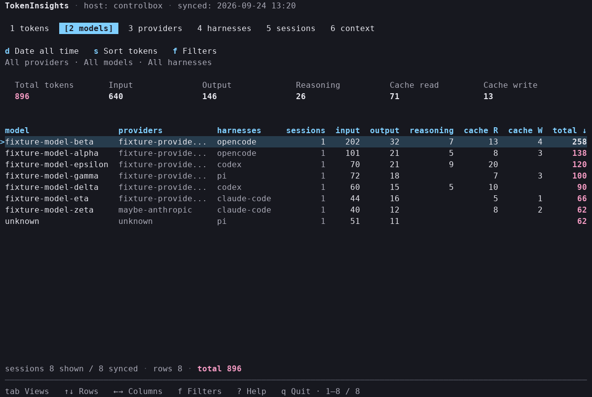

# TokenInsights

Local token usage dashboard for OpenCode, Pi, Codex, and Claude Code.

TokenInsights is a sync-first Go CLI. It reads local harness artifacts, normalizes raw facts into canonical token usage data, and opens an interactive terminal usage dashboard.

**Supported harnesses: opencode, pi, codex and claude-code.**



## Install

### Homebrew

```sh
# homebrew
brew install flexdinesh/tap/tokeninsights

# go (stable)
go install github.com/flexdinesh/tokeninsights/packages/cli/cmd/tokeninsights@latest

# go (dev branch)
go install github.com/flexdinesh/tokeninsights/packages/cli/cmd/tokeninsights@dev
```

## Usage

### Sync Data

Read harness artifacts and normalize data from supported harnesses. `tokeninsights view` syncs all supported harnesses implicitly by default, so use explicit sync when you want targeted harness refreshes, dry runs, full refreshes, or custom source directories.

OpenCode SQLite plus Pi, Codex, and Claude Code JSONL sync use Recent Source Refresh: after a successful refresh, old unchanged sources can be skipped on later syncs while recent or changed sources are still parsed. The freshness window is 48 hours before the last successful source refresh. `sync --dry-run` previews those skips without writing to the database, and `sync --full-refresh` ignores source refresh state for the requested harness scope without requeueing all existing raw facts.

```sh
# sync all supported harnesses
tokeninsights sync --all

# sync a specific harness
tokeninsights sync --harness pi

# other sync options
## preview refresh work without writing to the database
tokeninsights sync --all --dry-run

## ignore source refresh state and parse discovered sources
tokeninsights sync --all --full-refresh

## skip automatic canonical normalization after ingestion; pending work is saved for a later normalize
tokeninsights sync --all --no-normalize

## override default harness source directory
tokeninsights sync --all --source-dir /path/to/custom/fixtures
```

### Open TUI View

Launch the interactive terminal user interface (TUI) to view the token dashboard. By default, `view` opens into a sync progress screen, refreshes all supported Durable Sources, processes pending normalization work, then renders the dashboard. You can pre-filter the displayed data or set time buckets.
The dashboard statusline shows `TokenInsights · daterange: <range> · hostname: <host> · lastsynced: <time>`. Preset date ranges use their short names (`today`, `yesterday`, `week`, `month`, `year`, or `all time`), while custom bounds render as `from..to`, `from..`, or `..to`. The statusline stays on one terminal row and progressively shortens lower-priority hostname and sync details on narrow terminals. Sync time appears in the statusline rather than the footer.
The table has a pinned, full-width summary band that stays visible during vertical and horizontal scrolling. After a blank spacer row, it left-aligns the row count and token total for the full filtered result set as `rows <count> · total <tokens>`; the context view shows only its row count. Loading reserves a blank summary row to keep the layout stable, and loaded empty token views show `rows 0 · total 0`. The footer retains shortcuts, scroll position, active filters, and loading state, but no longer repeats row or total values.
The token views use short cache labels (`cache R`, `cache W`), and the sessions view includes a derived `ctx used` column that shows the peak prompt-side token load without counting assistant output or reasoning tokens.
The context view groups by harness, provider, and model, then summarizes Session Peak Context Load across sessions with `avg ctx`, `median ctx`, and `max ctx`.
Rows with multiple summary values stack them vertically instead of collapsing them to a count.

```sh
# open default view (this month, daily buckets)
tokeninsights view

# open existing canonical data without syncing
tokeninsights view --no-sync

# view preset date ranges
tokeninsights view --today
tokeninsights view --yesterday
tokeninsights view --week
tokeninsights view --month
tokeninsights view --year
tokeninsights view --all-time

# filter view data and choose time buckets
tokeninsights view --month --bucket day
tokeninsights view --week --provider openai --model gpt-5
tokeninsights view --harness pi

```

Viewer filters such as `--harness`, `--provider`, and `--model` only filter displayed canonical facts; they do not limit the implicit sync. The sync progress screen shows high-level harness statuses without source paths or source IDs. If implicit sync fails, the TUI exits; refresh unaffected harnesses manually with `tokeninsights sync --harness <harness>`, then open `tokeninsights view --no-sync`.

### Maintenance & Debugging

These commands are primarily used for debugging, diagnostics, or manual database management.

#### Rebuild Canonical Tables

Rebuild canonical facts and diagnostic records from already-ingested raw facts. Typically run automatically by `sync`.

```sh
# Normalize all harnesses
tokeninsights normalize

# Dry-run normalization to preview pending canonical work
tokeninsights normalize --dry-run
```

#### Purge Canonical Tables

Purge normalized canonical facts and diagnostics without deleting raw ingested facts, observations, or source refresh state. Existing raw token facts are requeued so `tokeninsights normalize` can rebuild canonical data.

```sh
tokeninsights reset-canonical --confirm
```

#### Reset Local Database

Completely wipe and recreate the local SQLite database and its sidecars to start fresh. This clears raw facts, canonical facts, pending normalization work, and source refresh state.

```sh
tokeninsights reset-all --confirm
```

### Default Database Path

```text
~/.local/share/tokeninsights/tokeninsights.sqlite
```

_You can customize the DB path using the `--db-path` flag or the `TOKENINSIGHTS_DB_PATH` environment variable._

## Development

```sh
# Verify Go embeds and schema synchronization
pnpm run check-schema

# Run all tests across the repository packages
pnpm run test

# Build local binaries
pnpm run build

# Install the locally compiled CLI binary
pnpm run install:cli
```

### Important Documentation

For deeper details, refer to:

- **[Design Guide](docs/design.md)**: Core architecture, SQLite schema definition, data pipelines, and canonical invariants.
- **[Development Guide](docs/development.md)**: Comprehensive setup, local testing, and package structure details.
- **[Release Guide](docs/release.md)**: Details on CLI releases, tagging rules, and CI automation workflows.
