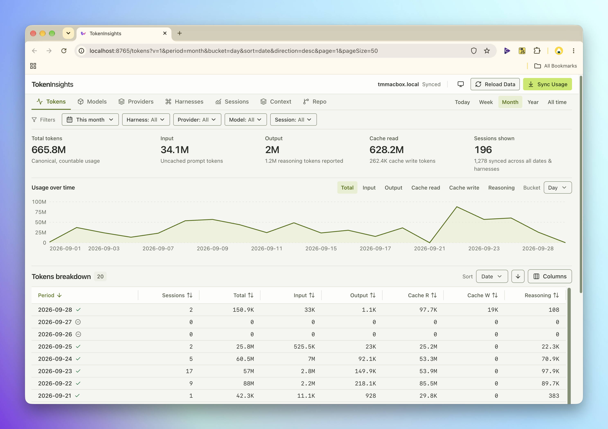
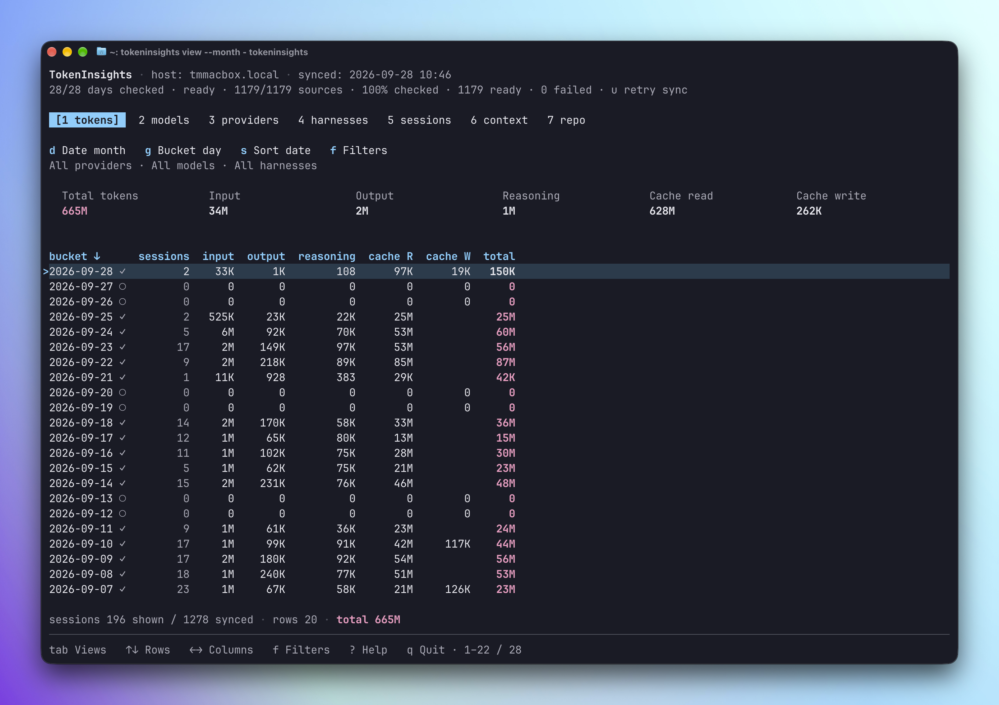

# TokenInsights

TokenInsights is a token usage dashboard for OpenCode, Pi, Codex, and Claude Code. A Go collector captures sanitized evidence in SQLite. Shared ingestion and processing store token data in DuckDB, either inside one local command or in an authenticated remote container.

The Repo view groups token, model, and provider usage by repository or directory. Location filters apply only there. Missing location data appears as **unknown**; the web view lets you expand an unknown row to see recorded contributing directories when available.

| Web                                                                                  | TUI                                                                       |
| ------------------------------------------------------------------------------------ | ------------------------------------------------------------------------- |
|  |  |

## Install

With Homebrew:

```sh
brew install flexdinesh/tap/tokeninsights
```

With Go:

```sh
go install github.com/flexdinesh/tokeninsights/packages/cli/cmd/tokeninsights@latest
```

`@latest` installs the latest stable version, published manually from `main`. Use `@v0.1.3` to pin a stable version.

See [release channels and workflow](docs/release.md).

## Run

Single-process mode is the default. No daemon or separate server setup:

```sh
tokeninsights tui                    # show saved usage; refresh in background
tokeninsights web                    # open dashboard; collect and ingest in background
tokeninsights web --host 0.0.0.0      # expose read-only dashboard on all IPv4 interfaces
tokeninsights sync                   # collect and ingest without a viewer
tokeninsights tui --sync=false       # query saved usage
tokeninsights web --sync=false
```

`web` remains foreground until terminated; its server stops with it. Default bind is
`127.0.0.1:8765`. With a wildcard bind, the local browser opens a loopback URL. Use
`--open=false` to print the URL without opening a browser. One viewer owns a token
database at a time. Sync requests arriving while a viewer runs are queued locally
and collected/ingested inside that viewer's process. TUI queries and local ingestion
never use HTTP. Browser Reload and TUI `r` only query saved data. Browser Reload
is available only in single-process mode, including `--sync=false`.

Local TUI and Web open after storage initialization, before collection finishes. The
dashboard shows collection, submission, and processing progress while saved usage
remains readable; new published revisions refresh automatically. Collection errors
remain visible without closing the dashboard. Run `tokeninsights sync` to retry
collection through the owning viewer. Hosted dashboards expose no collector progress.
The local hostname identifies the machine running the viewer, not the producer of
every historical fact. Imported history may include other machines.

The TUI keeps a visible refresh strip above navigation: saved usage remains usable
during collection, submission, and processing. Four persistent harness rows show
discovery, reading, saving and finalized source counts with remaining work;
unknown discovery totals stay unknown. Counts measure source files/databases,
not sessions or tokens. Failed and quarantined sources remain explicit.
Submission shows acknowledged entries and pending entries; processing shows the
current local dataset backlog, which may include earlier work. No overall
percentage or ETA is estimated. This detail is single-process TUI only;
browser and distributed collector/server progress contracts are unchanged.
Completion appears only after
processing is query-visible and a successful dashboard read displays that revision;
acceptance alone is not completion. Failures and quarantined sources show an
incomplete refresh without discarding saved usage. `--sync=false` skips startup
collection while durable pending processing still resumes. Quit cancels and joins
background work. `query_timeout` refers to reading usage. Reprocessing is explicit,
never automatic.

TUI loads its complete result in one consistent snapshot, using the same analytics
as Web and retaining its 100,000-row limit. Date ranges narrow analytics work;
startup collection checks the same sources for every range.

For distributed mode, run one authenticated [server container](docs/deployment.md)
and configure the collector:

```sh
tokeninsights config set mode distributed
tokeninsights config set server-url https://usage.example.com
tokeninsights config set server-token  # secure prompt/stdin; no token argument
tokeninsights sync                     # finite background worker
tokeninsights sync --print             # also submits; stdout is only remote URL
tokeninsights sync --wait              # foreground acceptance for scripts
tokeninsights sync --debug             # capture/acceptance/receipt progress UI
tokeninsights sync status --json
tokeninsights web                      # sync then open remote browser login
```

Background success means the job was saved and its worker started, not that upload
or processing succeeded. Check `sync status`. Workers have a ten-minute bound and
at most three delivery attempts, respecting Retry-After. Later explicit sync replays
retained immutable requests and resumes earlier queued requests for the same
endpoint/credential. Completed job history retains the latest 1,000 terminal jobs; queued/running work is retained.
Jobs never store bearer tokens. Ordinary remote sync supports
an ingest-only token; debug also needs read permission and waits on its own receipts.
Distributed mode has no analytics TUI. Remote failure never starts a local fallback.

Both modes use the same identity, normalization, ambiguity, estimates and deduplication
rules. All four harnesses are collected by default. Plugins invoke `sync --wait`
with their own `--harness`; richer event payloads are not accepted. Useful options:

```sh
tokeninsights sync --harness codex
tokeninsights sync --publish-only       # retry retained evidence without collection
tokeninsights sync --full-refresh       # reread sources/retry quarantine
tokeninsights sync --dry-run            # parse without persistent writes or delivery
```

Equal token counts never establish duplicate identity. Durable native session,
message and request identities govern contributions; all five components remain
atomic. Exact retries return original receipts. Collector deletion, source removal
and interrupted uploads do not erase server history or inflate confirmed totals.
Ambiguous usable counters remain separate estimates.

Configuration lives in `${XDG_CONFIG_HOME:-~/.config}/tokeninsights/config.json`,
private and atomically written. Keys: `mode`, `server-url`, `server-token`, `host`,
`port`, `collector-db-path`, `server-db-path`, `app-db-path`. Flags override environment,
then file, then defaults. `TOKENINSIGHTS_MODE`, `TOKENINSIGHTS_ACCESS_TOKEN` and the
role-specific path environment variables are supported. `config get server-token`
only reports whether configured. A configured remote URL selects distributed mode unless mode is explicit.
To return local, remove remote URL/token and set mode `single-process`.

Storage: `collector.sqlite` for source continuity/outbox, `server.duckdb` for token
history/receipts/processing, `app.sqlite` for users/credentials/system state. App and
token databases are paired by identity. Operational sync jobs use
`<canonical-collector-path>.jobs.sqlite`. Defaults live under XDG data home.

Bare invocation prints help. Local viewers own their foreground runtime.
Local maintenance uses `data reprocess|wait`. Legacy `service`, `server`, and
`collector` commands are removed. Never pair one
`app.sqlite` with another token database or reuse personal history as a hosted account.

## Privacy

Local mode keeps data on your machine. Selecting another server submits whitelisted native evidence, retained indefinitely initially for replay. It stores usage metadata such as token counts, timestamps, models, providers, session identifiers, hashed location keys, and display names. Directory paths use `~/` where a home directory can be identified; otherwise a full directory path may remain in collector storage. It does not store prompts, responses, tool arguments, tool output, source artifact paths, or full Git remote URLs.

Default files under `${XDG_DATA_HOME:-~/.local/share}/tokeninsights/`:

| Role | File | Flag / environment |
| --- | --- | --- |
| Host collector | `collector.sqlite` | `--collector-db-path` / `TOKENINSIGHTS_COLLECTOR_DB_PATH` |
| Token data | `server.duckdb` | `--server-db-path` / `TOKENINSIGHTS_SERVER_DB_PATH` |
| Application | `app.sqlite` | `--app-db-path` / `TOKENINSIGHTS_APP_DB_PATH` |
| Sync jobs | `<collector-path>.jobs.sqlite` | Derived from collector path |

Each role uses its own database. Fresh databases collect retained sources and ingest sanitized evidence. Paths cannot alias; wrong storage roles reject without mutation. Existing unrelated files stay untouched.

Storage uses collector schema **20**, DuckDB schema **3**, application SQLite schema **2** and job SQLite schema **1**. Only current schemas are supported; incompatible contracts reject without mutation. No imports or migrations. Fresh collection rebuilds usage from retained sources. Reprocessing within a current DuckDB preserves the published generation until its replacement is complete.

Rebuild earlier PR databases from retained sources into fresh files. Normalized source times must be valid Unix milliseconds; invalid observations remain server evidence with diagnostics. Filename-derived Pi/Claude sessions remain raw-only until native session evidence exists. Local ingestion runs directly within the owning command; its web listener exposes no ingestion route. Hosted access uses per-user tokens; it does not restore the removed shared-server-token mode.

Raw provider and model values retain the harness names. Stored canonical values used by filters and dashboards map Pi `openai-codex` to `openai`, map `fireworks-ai` to `fireworks`, and shorten Fireworks model names by removing `accounts/fireworks/models/`. Server processing canonicalizes names in each projection.

Server exposes processed metadata to reachable dashboard clients. Default localhost binding keeps the local experience on this machine. Publication sends directory basenames and stable location keys, not collector-local directory paths or private content.

## Documentation

[ADR 0009](docs/adr/0009-single-process-and-distributed-compositions.md) records the approved runtime composition; the [development guide](docs/development.md) defines verification gates.

- [CLI reference](packages/cli/README.md)
- [Development guide](docs/development.md)
- [Ingestion benchmarks and profiling](docs/ingestion-performance.md) — reproducible acceptance/publication workloads, measurements and optimization priorities.
- [System boundaries](docs/system.md) and [storage/processing contract](docs/design.md)
- [Docker and hosted deployment](docs/deployment.md)
- [Architecture principles](docs/adr/0010-current-contracts-and-boundaries.md) — ownership, composition, current contracts and verification.
- [Collector/ingestion failure tests](docs/collector-ingestion-tests.md) — guarantees, synthetic fixtures, executable coverage, and future acceptance gates.
- [Completion plugins](docs/plugins.md) — thin completion hooks, install artifacts, and host verification scope.


## Evidence, processing and upgrades

DuckDB uses a shared 1 GB memory budget for ingestion, processing and analytics.

Distributed `sync --wait` waits for acceptance. Local TUI and Web show saved data
during collection and processing. The browser shows usage totals by default;
**Review excluded usage** opens separate saved counters that cannot be confidently included.
Date ranges and filters apply to both views; excluded usage never inflates the main totals.
Unusable evidence retains diagnostics.
Local maintenance:

    tokeninsights data reprocess
    tokeninsights data wait

Reprocessing keeps the published generation until complete.
Local data maintenance has a 30-second visibility wait. TUI queries confirmed usage.
If reprocessing exceeds that wait, `data wait` resumes the saved generation without
starting another rebuild. Persistent `processing_failed` errors can be recovered
with `data reprocess`; keep a stopped backup of the paired databases and application
guard before maintenance. Raw evidence and the old published generation remain intact.
CGO/C/C++ toolchain builds embedded DuckDB. Production native archives need no JS.

Application pairing also persists `<canonical-token-path>.application.json`, containing
only the application instance ID. Keep this guard with both databases in stopped
backups. A missing/replaced app database fails closed to preserve credential revocations. Restore the matched set; do not delete the guard to bypass recovery.

## Incompatible data

If you encounter incompatible data, delete the old local data:

```sh
rm -rf ~/.local/share/tokeninsights
```

Then reinstall TokenInsights using your preferred installation method.
