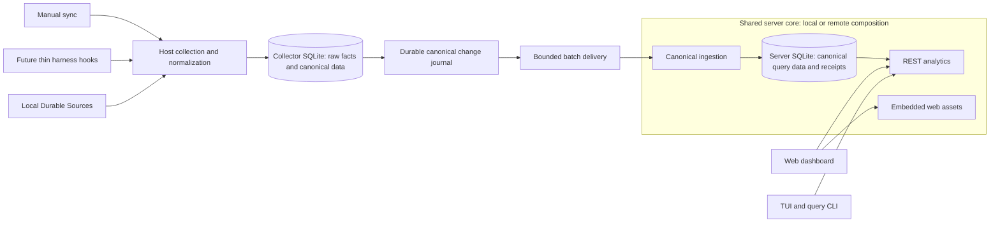

# Collector/server architecture proposal

Status: **PROPOSED; not the implemented architecture.** Reviewed direction: 5 October 2026. This task establishes traceable requirements and synthetic fixtures before runtime or schema implementation.

[design.md](design.md) describes today's product. This proposal does not change its current behavior, SQLite contracts, or REST API. The [PRD](../.scratch/collector-ingestion/PRD.md) records implementation gates; the [failure contract](collector-ingestion-tests.md) owns failure cases and their verification status.

## Responsibility change

Today the persistent service can discover local Durable Sources, run sync/normalization, and serve canonical data from the same SQLite database. The TUI reads that database directly. The proposed server cannot inspect producer files: the host collector owns capture and normalization, then publishes canonical entities into a separate server database.

Local and remote are two compositions of one server core, not two servers required on every machine. Local is the default destination. Remote composition and transport boundaries are prepared now; remote deployment, authentication provisioning, and setup remain later work. Selecting a remote destination must not implicitly start a local server or relay through it.

| Collector owns | Server owns |
| --- | --- |
| Durable Source discovery and harness adapters | Canonical ingestion validation |
| Metadata-only raw facts and observations | Stable-entity dedupe and batch replay identity |
| Continuity proofs and parsing cursors | Atomic persistence and receipts |
| Canonical normalization and diagnostics | Canonical query indexes and analytics |
| Reproducible published entity IDs | REST endpoints and embedded web assets |
| Change journal and destination delivery progress | Deployment-established ownership scope |

Raw facts remain metadata-only locally: retaining raw facts does not authorize storing transcripts, provider payloads, full source paths, secrets, or tool contents. Only allowlisted canonical data crosses ingestion. Collector-local row IDs, source cursors, and continuity markers never become server dependencies.

## Agreed scope

- Primary workflow is manually invoked `sync`: collect, normalize locally, publish pending canonical changes, report outcomes.
- Collector SQLite retains raw and canonical facts. Source continuity is an optimization; full parsing remains the correctness fallback.
- Server stores already-normalized entities; it has no harness parser or raw-fact normalization worker.
- Stable entity identity dedupes reconstructed uploads after collector database deletion. Batch identity dedupes delivery retries.
- Canonical changes and publication journal records commit together. Delivery progress is destination-specific.
- Successful server acknowledgement means committed and queryable. No separate asynchronous server inbox is required initially; admission and transaction sizes remain bounded.
- Queries show committed available data. Neither viewer queries nor server startup scan producer files or promise account-wide completeness.
- Thin future plugins invoke the same collector path. Hooks are additional triggers, not another source of accounting logic.
- No retractions, producer backflow, autonomous retry agent, or automatic completeness reconciliation is required in this scope. Source disappearance does not delete server history.
- Compatibility is explicit: compatible versions are accepted; incompatible versions require an approved upgrade/migration or rejection without data loss.

This supersedes the earlier discussion of uploading extracted raw observations for server-side normalization and an asynchronous server normalization queue. It also proposes replacing today's service-owned collection and TUI SQLite reads. Those changes are not implemented by these documents.

## Stable identity and canonical value

The invariant is conditional and testable: **the same retained source set, including attribution/ancestry dependencies, under the same supported parsing and accounting rules produces the same published entity IDs and normalized values, regardless of collector database state.** Source content changes and incompatible accounting changes are separate cases.

Derive IDs from harness-native identity wherever available. Sessions, optional messages, usage facts, and other actually published entities need their own identity rules. Conceptually, a usage fact identifies the harness, originating native session, native message/request/event, and usage kind. Reporting parent session is a relationship, separate from originating identity. Exact fields and hash encoding remain adapter-contract work, not a new schema in this proposal.

Exclude token values, collection time, local row IDs, producer installation/stream IDs, batch IDs, filesystem paths, and mutable attribution from fact identity. Source namespaces needed to distinguish native-ID collisions must themselves survive reconstruction; an installation-generated UUID alone cannot provide that guarantee. Hostname is a label. Server-established ownership scopes uniqueness without trusting an arbitrary owner supplied by a producer.

Use deterministic unambiguous encoding before hashing. A canonical payload hash identifies equal normalized values independently of JSON object ordering or delivery metadata; it does not replace fact identity. Equal token counters do not prove equal requests.

| Incoming publication | Intended server outcome |
| --- | --- |
| New stable identity | Insert canonical entity |
| Existing identity, equal canonical value | Successful no-op |
| Reused batch identity, identical batch | Return matching durable receipt |
| Reused batch identity, changed batch | Reject replay conflict without mutation |
| Existing fact identity, changed value | Never add a second contribution; update precedence requires its own rule |

Changed-value precedence remains unresolved where native revision evidence is insufficient. A collector sequence orders its own journal, not independent streams or a recreated database. Arrival time, installation time, and largest-counter-wins are not accepted universal precedence rules. Until an adapter/version-specific policy is approved and tested, conflicts must be explicit and existing totals preserved. No generic retraction machinery is proposed.

Native-ID absence, mutable source events, copied histories, and independently colliding native IDs need fixtures and documented adapter rules. The proposal does not claim all existing adapters already meet the publication identity invariant.

Deterministic identity is distinct from collision-free accounting: two native facts can deterministically collapse to the same canonical key, producing repeatable but incorrect totals. The identity audit examines current OpenCode copy suppression, Pi records without native message IDs, and Claude request identity. Codex snapshot hashing remains deterministic for unchanged input and distinguishes some same-time events; changing counters changes the input. The current canonical observation-time fallback is a latent boundary risk, because active adapters require usable occurrence timestamps.

## Manual sync and persistence boundaries

1. Resolve collector configuration and selected destination. Serialize collector mutation using existing writer ownership concepts.
2. Discover Durable Sources and validate continuity. Parse changed data from stable source extents or a consistent source database snapshot; uncertain continuity falls back to full parsing.
3. Commit captured raw facts, observations, normalization work, and applicable source progress together. Failed preparation cannot advance source progress.
4. Normalize pending work. Commit canonical changes, completed normalization work, and corresponding journal records together. A diagnostic can complete unsuitable raw work without manufacturing a usage fact.
5. Prepare a bounded immutable publication batch from pending journal entries, including required referenced entities. Persist its retry identity and exact payload before sending.
6. Discover/start the local server only for local delivery. Remote delivery uses the configured destination directly. Collection remains useful if delivery is unavailable.
7. Server validates compatibility, entity invariants, references, ownership scope, and replay identity. One transaction commits all accepted canonical changes and the receipt, or neither. Concurrent duplicate uploads serialize through durable uniqueness, not a process-local cache.
8. Return success after commit. Collector validates the receipt against the destination, batch, and submitted range before advancing its contiguous delivery cursor transactionally.
9. Report collection, normalization, delivery, and diagnostics separately. A subsequent manual `sync` resumes pending work. No background wakeup is implied.

Acknowledged prefixes can progress before a later batch fails. The failed suffix remains pending; a sync error does not roll back already-committed earlier batches. Explicit conflicts cannot be presented as fully successful delivery; their receipt/cursor treatment is a contract decision still pending.

| Crash boundary | Durable state and required recovery |
| --- | --- |
| Before captured source commit | No progress advance; reread source |
| After capture, before normalization | Raw facts and pending work survive; normalize next invocation |
| Before canonical/journal commit | Both roll back; pending normalization remains |
| After canonical/journal commit, before send | Pending canonical publication survives |
| Server failure before ingestion commit | No accepted batch; retry saved payload |
| Server commit before response arrives | Data is queryable; replay returns matching receipt |
| Receipt arrives before collector progress commit | Retry safely; no duplicate contribution |
| Collector database removed | Reparse retained sources with new delivery state and unchanged entity IDs |

These are proposed acceptance conditions. SQLite/disk corruption, deletion of undelivered collector data whose sources no longer exist, or unavailable native identities are not made recoverable by retries. Failure tests must state their assumptions rather than claim universal failure immunity.

## Traceable guarantees

Guarantee IDs below are stable review/test references. They describe required future behavior; the failure document distinguishes existing pipeline tests from proposed server coverage.

| ID | Required guarantee | Primary failure cases |
| --- | --- | --- |
| G01 | Published identity is source-derived and reproducible after collector database deletion; distinct native facts stay distinct | F01, F07 |
| G02 | Same complete retained source set and compatible rules yield equal normalized payloads and totals | F01, F04 |
| G03 | Source capture progress advances only with committed raw capture and normalization work | F14 |
| G04 | Canonical mutations and publication journal entries are atomic | F14 |
| G05 | Durable batch replay and stable fact dedupe work independently of collector delivery state | F01, F02, F03, F05 |
| G06 | Successful acknowledgement means the batch and receipt are committed and queryable; invalid batches expose no partial changes | F02, F08, F10, F14 |
| G07 | Destination delivery progress advances only through validated acknowledgements of contiguous submitted work | F02, F06, F14 |
| G08 | Uploads exclude raw source content and local-only continuity data | F12 |
| G09 | Unsupported compatibility is rejected without mutation; incompatible changes require explicit upgrade/migration | F09 |
| G10 | Pending work survives ordinary failures and resumes on manual invocation; missing sources preserve server history | F11, F13, F14 |
| G11 | Diagnostics distinguish capture, normalization, compatibility, replay, identity conflict, and delivery failures without leaking source content | F03, F04, F08, F09, F10, F11, F12, F14 |

## Test-driven implementation gates

1. **Evidence first:** retain synthetic harness-native fixtures, hand-reviewed expected facts/totals, stable fixture/scenario IDs, and an identity audit. Add database deletion/reparse, full versus incremental parsing, relocation, duplicate streaming, ancestry, malformed input, and missing-identity tests. Record genuine current defects instead of changing expected results to match them.
2. **Contract review:** choose adapter identity rules, canonical entity boundaries, changed-value handling, compatibility categories, and limits. Write expected receipts and query outcomes for the failure matrix. Obtain explicit approval before modifying SQLite or cross-language schema contracts.
3. **Collector persistence:** implement the approved journal/delivery storage and atomic boundaries. Inject failures before and after commits; reopen SQLite and verify persisted rows/progress. Tests must check totals and identity, not just row counts.
4. **Server ingestion:** implement canonical validation, stable fact uniqueness, durable batch receipts, and synchronous transactional publication. Exercise real server persistence with duplicate/reordered/concurrent uploads and lost responses; a fake server alone is insufficient.
5. **Local composition:** move collection out of server runtime, route viewers through query APIs, and preserve native Go builds. Exercise manual sync failure/resume and independent collector rebuild against an existing server.
6. **Remote readiness:** reuse the server core and ingestion client in a foreground composition. Remote setup and plugins follow separately; they reuse the established contract and regression suite.

Trace each test to fixture, scenario Fxx, and guarantee Gxx. Preserve reviewable expected values separately from generated output. Mutation/fault tests should demonstrate the suite catches duplicate inserts, early acknowledgements, premature progress advances, and partial batch visibility. Full suite success today must never be described as proof of an unimplemented ingestion path.

## Prior art and compatibility

Servediff's inspected architecture/system documents separate Git-aware collection from local/remote compositions of one ingestion/query core. Its current hook engine writes a small trigger before a finite worker performs collection/delivery. Those boundaries transfer. Its content-snapshot reuse, expiry, bounded disposable pending payloads, and arrival-based freshness do not define TokenInsights historical accounting or stable fact identity.

Current TokenInsights ADRs [0004](adr/0004-incremental-source-refresh-and-local-continuity-state.md) and [0005](adr/0005-persistent-service-and-explicit-refresh.md) remain historical/implemented evidence. Existing verified continuity, metadata privacy, session-centric canonical facts, additive token semantics, provider/model fallbacks, TPS concepts, and Go-only runtime constraints carry forward. Server-side schema upgrades cannot assume that discarded producer files remain available for rebuilding historical data. Migration specifics remain pending.

## Unresolved questions

- Stable fallback/native-ID namespace per harness?
- Which canonical entities cross ingestion?
- Changed-value precedence without native revisions?
- Conflict receipt and cursor behavior?
- Compatibility categories and identity migration?
- Batch/admission limits and diagnostic retention?
- Local DB locations and migration from today's single DB?
- CLI/viewer transition and reporting timezone?
