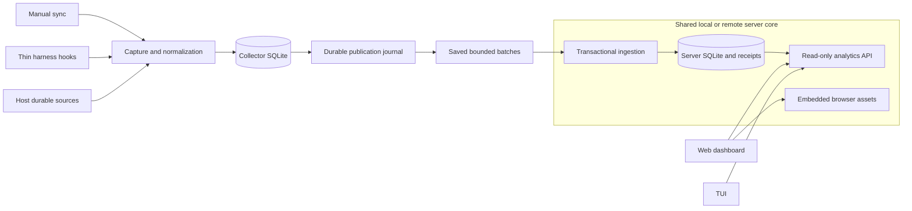

# Collector/server architecture

Status: **Accepted; implemented in PR #53.** Decision: 5 October 2026.
The approved split creates fresh `collector.sqlite` and `server.sqlite` files.
The old `tokeninsights.sqlite` file stays untouched; this change does not import
legacy history or migrate legacy identities.

[design.md](design.md) describes the product; [ADR 0006](adr/0006-collector-server-ingestion.md)
records this decision. The [storage contract](../.scratch/collector-ingestion/STORAGE-CONTRACT-PROPOSAL.md)
defines persistence and wire details. The [failure contract](collector-ingestion-tests.md)
and [validation record](../.scratch/collector-ingestion/VALIDATION.md) distinguish
implemented assertions from remaining coverage. A guarantee alone does not prove
every related failure has been tested.

## Ownership and compositions

Local and remote compose the same native Go ingestion/query core. Local is the
default. Selecting `--server-url` publishes directly without starting a local
server. Remote deployment and credential provisioning remain later work.
Every non-loopback bind requires an explicit token, including managed
`service` commands. Tokens protect public assets and APIs; private administration
stays on the owner-only Unix socket.

| Collector owns | Server owns |
| --- | --- |
| Harness discovery, parsing, ancestry and continuity | Strict normalized-publication validation |
| Metadata-only raw facts, normalization and diagnostics | Stable fact dedupe and durable batch receipts |
| Source cursors and canonical facts | Atomic canonical persistence and analytics revision |
| Source identity derivation and publication journal | Canonical queries, REST and embedded web assets |
| Destination binding, saved requests and acknowledgement cursor | One database-established owner, initially `default` |

Multiple machines may publish for that owner. Hostname is a display label, never
identity; copied native histories dedupe independently of the publishing host.
The server has no application controller, source discovery, parser, source-root
configuration or startup normalization. Shared analytics SQL reads canonical
tables through a server-owned read transaction. The server makes no claim about
source completeness.

## Manual workflow and viewers

1. `sync` captures durable source changes and normalizes them in collector SQLite.
   Proven continuity allows incremental parsing; uncertainty falls back to full
   parsing. Capture progress commits with captured facts and pending work.
2. Normalization records publishable snapshots in its canonical writer
   transaction. Initially it scans the canonical snapshot inside that transaction
   and suppresses unchanged journal values. Missing occurrence/native identity
   evidence is withheld with a safe local diagnostic.
3. Delivery discovers capabilities and durable server database identity. It
   saves an immutable pending batch before sending. Unknown outcomes retain the
   exact bytes for the next manual attempt.
4. Ingestion commits facts, merged references, producer labels, metadata and
   receipt together. Success means committed and queryable; rejection exposes
   no partial batch.
5. The collector validates receipt identity, range, exact request hash and counts,
   then atomically saves the receipt and advances a contiguous destination cursor.

`sync --publish-only` resumes delivery without collection. Previously committed
work can still be delivered after a collection error. Earlier acknowledged
batches remain acknowledged when a later batch fails. Collection and delivery
outcomes are reported separately; no autonomous retry worker is implied.

Bare invocation ensures the local query service. `view` is read-only by default;
`view --sync` explicitly collects first. TUI reload and web Reload fetch saved
server data. `GET /api/v1/sync` remains compatibility status; POST returns 405.
The UI points to `tokeninsights sync` for collection. Query snapshots include
process instance, durable database epoch and analytics revision. A TUI snapshot
spanning pages retries when those change. TPS tabs and average, mean and median
concepts remain available when normalized timing data is absent.

Queries use the server reporting timezone. Instance metadata returns an IANA
name where resolvable, preserving historical daylight-saving rules. Otherwise
it explicitly returns the current fixed UTC offset; that fallback cannot
describe historical DST. Producer labels are `unknown`, a sole known hostname,
or `multiple machines`; absent producer metadata never becomes serving hostname.

## Identity and canonical values

Reproducibility assumes the same retained source set, including ancestry and
attribution dependencies, under the same supported parsing/accounting rules.
Deleting collector SQLite changes its stream and delivery state, not identities
derived from those sources.

IDs are SHA-256 of UTF-8 JSON string-array tuples:

| Entity | Tuple, in order |
| --- | --- |
| Session | `session-v1`, `default`, harness, native session ID |
| Message | `message-v1`, `default`, harness, native session ID, native message ID |
| Fact | `fact-v1`, `default`, harness, native session ID, native message ID or empty string, native request ID or empty string, usage scope |
| Location | `location-v1`, normalized directory key, normalized repository key |

Usage scope accepts only `message`. Each fact resolves to a stable session and
requires a nonempty native message or request identity. Tokens, sequence,
installation/stream/batch IDs, observation clock, hostname and location labels
do not enter this fact tuple. The canonical payload hash includes the normalized
contribution but zeros mergeable session first/last and message occurrence
envelopes. The exact-byte request hash binds delivery, not accounting identity.

Adapter evidence qualifies the native-ID rule:

- OpenCode native session/message identities distinguish equal-valued requests.
- Pi records without usable native message identity are withheld with diagnostics.
- Codex retains its existing adapter-derived immutable event witness in message
  identity. The witness includes source snapshot token values and field presence.
  Proven inherited replay retains the original owning identity. Distinct
  same-time snapshots remain distinct; changed counters change the witness.
  Line-based fallbacks assume unchanged layout.
- Claude retains request identity where present. Only a fact with native session,
  message, request and source occurrence can use `claude-source-timestamp-v1`.
  Newer source timestamps replace one contribution; older ones are stale no-ops;
  equal timestamps with different canonical payloads conflict. Collector sequence
  is never revision evidence.

| Incoming publication | Outcome |
| --- | --- |
| New stable fact | Insert one contribution |
| Same identity and canonical payload | No-op contribution; merge occurrence references if needed |
| Same stream/batch and exact bytes | Return original durable receipt |
| Same stream/batch, changed bytes | 409, no mutation |
| Changed value, supported newer Claude revision | Replace one contribution |
| Changed value without supported ordering | 409; preserve data and pending collector suffix |

Session ranges merge source minima/maxima; message occurrence merges the earliest
source time. Reference changes can advance analytics revision for a no-op fact.
An entirely identical new batch does not advance revision, though its receipt,
producer label and last ingestion time commit. Exact batch replay changes none
of those timestamps.

## Failure boundaries and limits

| Boundary | Durable recovery |
| --- | --- |
| Capture fails before commit | No source progress; reread |
| Capture commits before normalization | Raw facts and pending work survive |
| Canonical/journal transaction fails | Both roll back |
| Journal commits before sending | Publication remains pending |
| Server fails before commit | Retry exact saved bytes; no partial batch |
| Server commits before response | Replay original receipt |
| Response precedes collector acknowledgement commit | Replay safely; cursor remains unadvanced |
| Collector database deleted | Reparse retained sources; stable facts dedupe |
| Source disappears | Committed server history remains |
| Local server database replaced | New binding replays journal from zero |
| Remote database changes at same URL | Reject binding; deliberate destination update required |

The collector journal is the durable queue. Server admission accepts at most four
concurrent requests using one SQLite connection; excess requests receive 503.
There is no asynchronous inbox acknowledged before persistence. Bodies are at
most 1 MiB, batches at most 256 contiguous facts, strings at most 256 UTF-8 bytes.
Exact nonnegative integers are bounded by 9,007,199,254,740,991. Component sums,
aggregate bounds and revision are checked before commit. Receipts and journal
have no retention cleanup initially.

Retries cannot repair corruption, vanished undelivered source data, absent native
identity or native-ID collisions. The initial fixed `default` namespace assumes
native IDs are unique within a harness's owner history. Profile namespaces need
a separate identity contract. No retraction, backflow or completeness
reconciliation is included.

## Traceable guarantees

IDs remain stable review/test references. Coverage and verification status belong
to the failure and validation documents.

| ID | Guarantee | Failure references |
| --- | --- | --- |
| G01 | Source-derived identity survives collector deletion; distinct facts stay distinct | F01, F07 |
| G02 | Same retained sources and rules yield equal payloads/totals | F01, F04 |
| G03 | Capture progress commits with facts and pending normalization work | F14 |
| G04 | Canonical mutations and publication journal commit together | F14 |
| G05 | Batch replay and fact dedupe are independent of collector progress | F01, F02, F03, F05 |
| G06 | Acknowledgement means committed/queryable; rejection is atomic | F02, F08, F10, F14 |
| G07 | Cursor advances only through validated contiguous acknowledgements | F02, F06, F14 |
| G08 | Uploads exclude raw content and local continuity state | F12 |
| G09 | Unsupported versions reject without mutation; incompatible changes need migration | F09 |
| G10 | Ordinary failures preserve pending work; source loss preserves server history | F11, F13, F14 |
| G11 | Fixed stage/code diagnostics distinguish failures without leaking raw content | F03, F04, F08, F09, F10, F11, F12, F14 |

Tests use synthetic harness fixtures, independently reviewed expected components,
real SQLite/HTTP and explicit crash seams. Check persisted identities, totals,
receipts and cursor state, not only row counts or fake transport success.

Servediff informed the collection/server boundary and shared compositions.
Its finite hook worker and disposable snapshots were not adopted. Initial thin
plugins invoke bounded collector sync with a 60-second hook deadline; interrupted
work resumes manually. Plugins contain no parser or independent delivery queue.

## Outstanding follow-up scope

- Remote setup, credential provisioning and multi-tenant authorization.
- Retention/compaction and explicit schema/identity migration tooling.
- Native profile namespaces if real collisions require them.
- Optional asynchronous hook execution and richer timing publication.

No unresolved implementation decisions require approval for this accepted scope.
