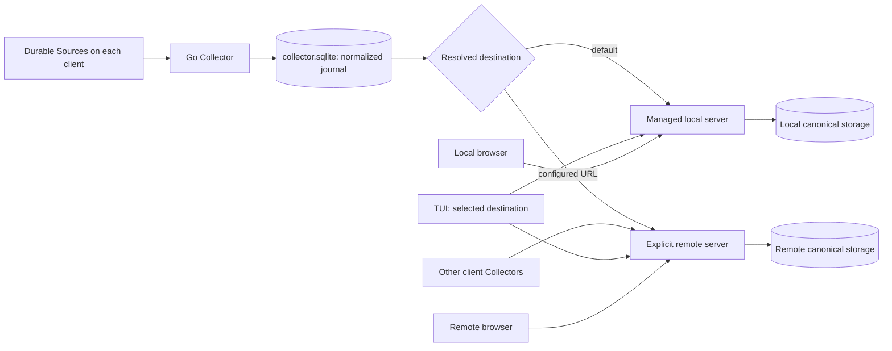

# System design

Decision date: 5 October 2026. Status: architecture direction accepted;
implemented in this change. Remote v1 uses a shared dataset with authentication
deferred. SQLite/synchronous ingestion is implemented; alternate backends, queues
and accounts remain future work.

TokenInsights has a host Collector and a Canonical Server. Collection and
normalization happen on each client machine. A client publishes normalized usage
to one selected server, local by default or explicitly configured remote. The
server owns durable ingestion, analytics queries and the embedded dashboard.

[design.md](design.md) records the implemented schema and pipeline contract.
This decision revises deployment, configuration and authentication boundaries
in [ADR 0006](adr/0006-collector-server-ingestion.md); it preserves normalized-only
ingestion, stable identities, durable publication and atomic commit receipts.
No database schema or publication protocol change is approved by this document.

## Implementation boundaries

`internal/config` owns typed client preferences and precedence; `cli` resolves
them once before operational commands. `internal/service` owns only local
lifecycle, discovery and Unix administration. `internal/remoteserver` independently
composes the foreground remote server. `internal/serverownership` shares canonical
database identity/lifetime locking across both deployments. Ingestion, queries
and embedded assets remain shared.

The current SQLite implementation deliberately remains concrete:
`ingestion.Core` owns SQL transactions; server handlers open canonical SQLite
snapshots. Alternate backends must revise both write and query boundaries as
described below. No backend-neutral interface is claimed yet.

The publication protocol, identities, per-destination acknowledgements and
Collector crash/rebuild contracts are unchanged. Real-binary deployment tests
exercise both executables through configuration, collection, committed receipts
and REST, including all four harnesses and copied/rebuilt client histories.

## Processes and deployment

Use two composition roots in the existing Go module:

| Deployment | Entry point | Lifetime | Default listener | Storage |
| --- | --- | --- | --- | --- |
| Local | `tokeninsights service start` | Managed background process | `127.0.0.1:8765` | Local `server.sqlite` |
| Remote | `tokeninsights-server` | Foreground, explicitly launched | `0.0.0.0:8765` | Deployment-selected server storage; SQLite initially |

On the remote machine:

```sh
tokeninsights-server --listen 0.0.0.0:8765 --server-db-path /var/lib/tokeninsights/server.sqlite
```

`packages/cli/cmd/tokeninsights` retains collection, configuration, local service
management, maintenance and TUI commands.
`packages/cli/cmd/tokeninsights-server` owns remote composition. Both embed the
same browser assets and compose the same ingestion/query application operations.
Production remains Go-only.

There is one server process per deployment. A workstation does not need a remote
server process, and a remote machine does not need a local service or Collector.
Clients send directly to their selected server. Local and remote deployments may
coexist with separate storage; there is no relay, mirroring or automatic fan-out.



The remote runtime has no local discovery record, per-user service preferences,
Unix administration endpoint or detached-child startup protocol. Its deployment
owns process supervision, persistent storage and any TLS termination. SQLite
database ownership remains protected so local and remote processes cannot open
the same file as competing servers. Shared `internal/serverownership` preserves database identity and lifetime locking.

The remote server does not require harness files, Git, repository mounts or a
JavaScript runtime. Starting either server never collects or normalizes sources.

## Client configuration

Client preferences use typed JSON at
`${XDG_CONFIG_HOME:-~/.config}/tokeninsights/config.json`. An absent file means
defaults and requires no setup. Configuration reads do not create files or
databases. `config set` creates the file and parent directory when needed.

Use keys matching existing CLI flags:

| Key | Type/default | Responsibility |
| --- | --- | --- |
| `server-url` | String; empty selects managed local | Destination for sync and TUI |
| `host` | IPv4 string; `127.0.0.1` | Local service bind only |
| `port` | Integer; `8765`; zero chooses a port | Local service bind only |
| `collector-db-path` | Path; existing Collector default | Client Collector storage |
| `server-db-path` | Path; existing server default | Managed local server storage only |

Example file:

```json
{
  "server-url": "http://usage.example.test:8765",
  "host": "127.0.0.1",
  "port": 8765
}
```

Example commands:

```sh
tokeninsights config set server-url http://usage.example.test:8765
tokeninsights config get server-url
tokeninsights sync
tokeninsights tui

# Return to the default local destination.
tokeninsights config remove server-url

# Expose the local service on the LAN.
tokeninsights config set host 0.0.0.0
tokeninsights service restart
```

`set KEY VALUE` writes a validated typed value; `get KEY` reads the stored value
or its built-in default. `remove KEY` removes a persisted override. Reject
unknown keys, malformed values and trailing arguments without changing the file.
Empty `server-url` explicitly selects local. URL validation uses the current
HTTP/HTTPS contract, excluding embedded credentials, query strings and fragments.
`config set` resolves relative database paths against the invocation directory
and stores absolute paths. Relative paths entered directly in JSON resolve
against the configuration file directory; explicit path flags resolve against
the invocation directory. Collector and local server paths cannot alias.

Configuration precedence is explicit flags > environment > file > defaults.
Flag presence and environment-variable presence matter: an explicitly empty
`--server-url` or `TOKENINSIGHTS_SERVER_URL` selects local even when the file
selects remote. Use typed optional overrides rather than treating empty strings
or port zero as unspecified. Environment values never become persisted values
merely because `config set` changes another key. `config get` reports persisted
preferences, not transient environment/flag overrides; help explains precedence.

Root `--config-file PATH` and `TOKENINSIGHTS_CONFIG_PATH` select the
client configuration file. File selection follows flag > environment > default.
An explicitly selected missing file also uses defaults until written. Config
commands use the same path resolution as collection and viewers.

Resolve and validate configuration once per invocation. Malformed configuration
fails before collection or server creation; help/version remain side-effect
free. Config writes are private, atomic and serialized to prevent two setters
from losing each other's changes. They never start, stop or restart a server.

Keep desired preferences separate from effective runtime state. Root config is
the user configuration; service records describe the running process. Changes
to bind/storage require an explicit restart. Sync/viewers may reuse an already
running local service until restart, while an explicit conflicting service-start
bind fails with restart guidance. Legacy runtime config version 2 is imported on explicit `service restart`:
unset root host/port preferences retain the legacy values, and root settings win.
Current runtime records retain effective configuration for lifecycle only; do not
let a second configuration source silently override the root file.

Remote deployment settings are separate from client preferences. Initially the
server receives explicit `--listen` and `--server-db-path` flags; it does not read
the client's `server-url`, Collector path or local bind preferences. Add a
deployment configuration format only when concrete backend/auth settings need
one. Do not expose configuration keys for unimplemented backends.

## Destination and command behavior

| Command | Behavior |
| --- | --- |
| Bare `tokeninsights` | Ensure/print the selected local endpoint, or report the configured remote endpoint without starting local |
| `sync` | Collect locally, normalize/journal, publish to resolved destination |
| `sync --publish-only` | Retry retained publication to resolved destination |
| `tui` | Collect/publish locally, then query the same resolved destination |
| `tui --sync=false` | Query selected server only; no Collector database access |
| `service start/stop/restart/status/run` | Manage the local deployment, irrespective of configured remote routing |
| `collector normalize/reset-*` | Operate on Collector storage only |
| `config set/get/remove` | Manage client preferences only |
| `tokeninsights-server` | Run the remote deployment in the foreground |

Service commands stay local so clients can inspect or stop an existing local
service after selecting remote routing. Completion plugins invoke the same Go
`sync` and inherit the same config resolution; no plugin-specific routing file.

A remote URL selects direct transport even when it points to loopback. Its
failure never starts or publishes to the local server. Local normalized work
and pending requests remain durable, and collection/delivery outcomes remain
separate. There is one destination per invocation, with no autonomous retry.

Changing `server-url` takes effect on the next client invocation. Retain each
destination's existing cursor and pending batch. A previously unseen destination
receives retained journal history, not just facts collected after the setting
changed. Returning to an existing destination resumes its own progress.
Remote publication does not open or require local server storage; move local
path checks into the local routing branch, retaining Collector validation.

## Shared ingestion and analytics

Every client retains its own Collector SQLite database, stream and publication
journal. The initial remote server pools clients into one shared dataset under
the existing owner `default`. This is multi-client ingestion, not per-user data
isolation. Per-client dashboards, accounts and authorization are later decisions.

Preserve the current normalized-publication protocol and privacy allowlist:
raw facts, source paths, parsing diagnostics and continuity stay local. Preserve
the configured limits and exact token-component accounting in both deployments.

Batch identity and fact identity remain distinct. Receipts identify stream/batch
replays; source-native identities dedupe facts across streams and rebuilt
Collectors. Hostnames and client installations never become fact identity.
Copied histories must not double-count. Conflicting reuse of native IDs and
unsupported competing values fail rather than silently overwriting facts.
Indistinguishable native-ID collisions cannot be detected by the current
contract; multi-client fixtures must audit each harness's native identity scope.
Do not introduce a producer namespace merely to avoid conflicts; that would
change dedupe semantics and requires separate identity/protocol review.

Facts, references, revision, producer labels and receipts commit atomically.
The Collector validates a matching receipt before advancing a contiguous
destination cursor. A lost response replays the saved immutable request.
Concurrent clients must preserve these semantics and query totals.

Remote destinations pin a durable server database identity. Replacement storage
at the same URL must fail the existing binding until explicitly re-established;
never treat it as another automatic local rebuild. Local replacement may retain
the existing deliberate replay behavior. The interface for deliberate remote
rebinding remains follow-up work.

## Storage and queue boundaries

Use SQLite and synchronous ingestion for the first remote deployment. Many
clients can submit to one HTTP server without each opening the database. Current
admission permits four requests, and canonical writes serialize through SQLite;
this is bounded concurrency, not a promised capacity target. Measure contention
and request latency before changing limits or choosing another backend.

SQLite WAL permits concurrent readers but one writer, and requires database
users on the same machine. A remote deployment's SQLite file stays on that
server's local storage, not a shared client mount. See
[SQLite WAL concurrency](https://www.sqlite.org/wal.html#concurrency).

Separate deployment wiring now; introduce backend interfaces around actual
application operations as concrete implementations need them:

- Ingestion accepts validated batches and returns durable commit receipts;
  transaction, replay checks, dedupe, reference merging and revision changes
  belong to the storage-backed operation.
- Analytics exposes status, facets and usage from a consistent snapshot carrying
  database identity and revision. HTTP handlers consume query operations rather
  than opening a SQLite path themselves.
- A backend owns lifecycle, compatibility checks, atomic ingestion and snapshot
  queries. Adapters must pass the same behavioral conformance suite. A generic
  SQL connection interface is insufficient for alternate storage engines.
- Remote composition selects concrete storage, admission and future auth
  dependencies. Local composition stays SQLite and synchronous, with no extra
  infrastructure dependencies.

Do not build a generic plugin framework or select PostgreSQL, RabbitMQ, Redis or
another backend before its requirements are known. The current SQLite adapter
can remain concrete during the deployment split; its coupling must be visible
and isolated rather than advertised as backend-neutral.

A future queue must distinguish durable acceptance from canonical commit.
The existing success receipt means committed and queryable. Broker publisher
confirmation does not prove consumer/application completion; see
[RabbitMQ acknowledgement boundaries](https://www.rabbitmq.com/docs/confirms).
This is a constraint on any queue design, not a choice of RabbitMQ.

Two compatible architectural options exist: wait for canonical commit before
returning the existing receipt, or version the protocol to introduce acceptance,
commit-status lookup and separate client progress. Merely enqueueing and returning
the current receipt is invalid. Workers must tolerate duplicate delivery and
acknowledge queue work only after the canonical transaction commits. Ordering,
failed-batch handling, request retention and receipt recovery need explicit
design before asynchronous ingestion is implemented. A queued deployment may
eventually add worker processes; the initial deployment remains one process.

## Authentication and ownership

The local public dashboard/API is unauthenticated, including when explicitly
bound to `0.0.0.0`. It serves all reachable clients. Local control remains private
to the OS user through its Unix socket, private directories and ownership locks;
removing public auth does not expose lifecycle operations.

First-remote policy: unauthenticated shared ingestion/query on a trusted network,
with application authentication deferred. The remote runtime provides a
composition boundary for future authentication and owner resolution.
When auth is added, establish the principal outside ingestion; never trust a
hostname or arbitrary owner field supplied by a client. Transport credentials
must not change stable fact identity within a dataset.

Remove the current public token settings from the revised local and initial
remote deployments. Existing `--token` / `TOKENINSIGHTS_SERVER_TOKEN` usage must
produce clear compatibility errors and release guidance, rather than appear to
protect an unauthenticated server. Upgrade handling must also detect saved local
credentials before dropping their protection. Future remote credentials belong
only to remote server/client transport, with an explicit configuration contract.
Local service commands must not apply remote credentials.
Multi-account identity/storage changes require separate explicit schema and
protocol approval; they are not implied by reserving an auth boundary.

## Tracer Bullet implementation and verification

1. Add typed client config and commands; route sync/TUI/default invocation through
   one resolver. Verify defaults, precedence including explicit empties, invalid
   config without side effects, atomic concurrent setters and destination switching.
2. Extract remote composition into its own binary. Reuse shared handlers and
   application operations; preserve database ownership while removing local
   discovery/control dependencies. Retire `tokeninsights server run` with an
   actionable command pointing to `tokeninsights-server`; retain `service run`.
3. Separate local public-auth policy and remote deployment policy. Verify local
   wildcard binding without a token and private lifecycle isolation. Define and
   test the upgrade handling for existing saved service settings/credentials.
4. Run multi-client integration fixtures against both compositions: distinct
   streams, copied histories, conflicting facts, concurrent retries, lost commit
   responses, all token components, receipts/cursors and REST totals. Verify remote
   failures and configured remote TUI never create/start local server storage.
5. Update build/install/release targets for both binaries, CLI help, README,
   design, architecture overview and ADRs to match implemented behavior. Build
   both directly from committed Go source and run with Node/npm/pnpm absent.

Deployment/configuration work should preserve Collector schema 16, server schema
2 and publication protocol 1. Any discovered need to change tables or serialized
contracts requires explicit approval before implementation. Future backend,
queue and account implementations are separate work with their own failure and
compatibility tests.

## Decision record and unresolved questions

Decided: separate local/remote composition roots and binaries; local by default;
config-driven direct remote routing; one destination for sync and TUI; local
public access without auth; remote v1 shared dataset and deferred auth; shared
normalized ingestion/query operations; SQLite/synchronous remote initially;
future backends and auth at deployment boundaries; atomic canonical commit
remains the receipt guarantee.

No unresolved questions for the implemented deployment/configuration scope.

Backend choice, asynchronous receipt protocol, multi-account identity and remote
rebinding UX are follow-up decisions, not blockers for the deployment/config split.

## References

- [Current implementation contract](design.md).
- [Collector/server architecture](collector-server-architecture.md).
- [Accepted collector/ingestion decision](adr/0006-collector-server-ingestion.md).
- Servediff reference: `docs/system.md`, `internal/daemon/server.go`,
  `internal/remoteserver/server.go` and `internal/serverapp/handler.go` in the
  sibling Servediff repository. It separates lifecycle/auth composition while
  sharing stored-data operations.
- [XDG Base Directory Specification](https://specifications.freedesktop.org/basedir/latest/)
  for the client configuration location.
