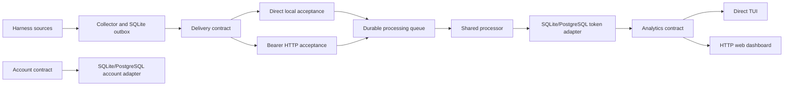

# System design

[ADR 0009](adr/0009-single-process-and-distributed-compositions.md) defines composition;
[design](design.md) specifies identities, schemas, processing and query contracts.

| Composition | Lifetime | Transport | Storage |
| --- | --- | --- | --- |
| Single-process `tui` | Foreground command | Direct acceptance and queries | Separate collector, token, application and job SQLite roles |
| Single-process `web` | Foreground command | Direct ingestion; read-only HTTP dashboard | Same local files |
| Distributed collector | Finite CLI/worker | Authenticated HTTP acceptance | Collector SQLite and operational jobs SQLite |
| Distributed server | One Docker container | Bearer ingestion/query; browser session; private admin | SQLite or PostgreSQL for paired token/account domains |

Local commands own one token database and join workers on exit. TUI never needs a
listener. Web reserves its requested listener and initializes storage, then opens
before collecting. Its capability-gated progress endpoint shows command-owned
startup capture; saved usage stays readable during processing.
Web remains foreground and joins capture/processing workers before storage closes.
One viewer owns local storage at a time. Local viewers own no sync-jobs queue.
Distributed sync may run concurrently through the shared collector writer lock;
its destination acknowledgements are independent of personal ingestion. Reload only queries saved usage; the
browser toolbar control is local-only. Local machine identity is shared by direct
and HTTP descriptors; it does not attribute captured history to this machine.

Distributed sync saves a job, starts a finite worker through private config/readiness
pipes and returns after startup ACK. `--print` also submits. `--wait` ends at acceptance;
`--debug` observes its receipts through processing. The latter needs read+ingest;
ordinary sync supports ingest-only. Later explicit sync can drain earlier queued
requests for the same endpoint/credential; no daemon or reboot delivery guarantee.

Collector continuity/outbox is separate from operational jobs so network submission
cannot hold up job admission. No bearer token is saved in job rows, logs or argv.
Shutdown/interruption leaves immutable saved requests available for replay.

Account provisioning records an inactive user with a fixed dataset, idempotently
creates that dataset, then activates the user. Restart resumes pending provisioning.
Application SQLite is paired to token storage identity. There is no cross-engine transaction.

Token storage, queue and query operations remain behind contracts. A future backend
must preserve atomic acceptance/projection, dataset isolation, stable identities,
all five token components, separate estimates, revision fences and consistent query
snapshots. Equal counters do not establish identity. See [design](design.md).

Configuration is private grouped home-directory JSON: shared `collector`,
`in-process` local storage/bind and `distributed` URL/token. Flags > environment >
file > defaults. Commands select composition: TUI/Web local, sync distributed,
browse URL-only. Remote credentials never change local command behavior; failures
never fall back local. Local Web defaults to 8765, hosted server to 8766.
Personal/hosted token and account stores remain separate. Bare invocation prints
help; `data reprocess/wait` remains local maintenance. Legacy service/server/
collector commands and global mode selection are removed. Production remains Go-only.
